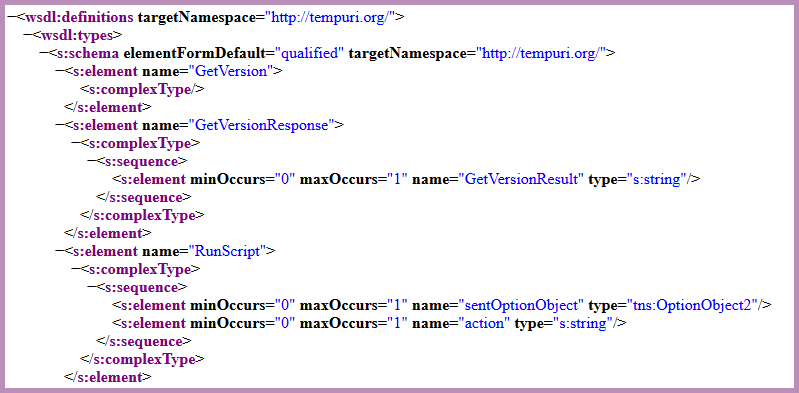
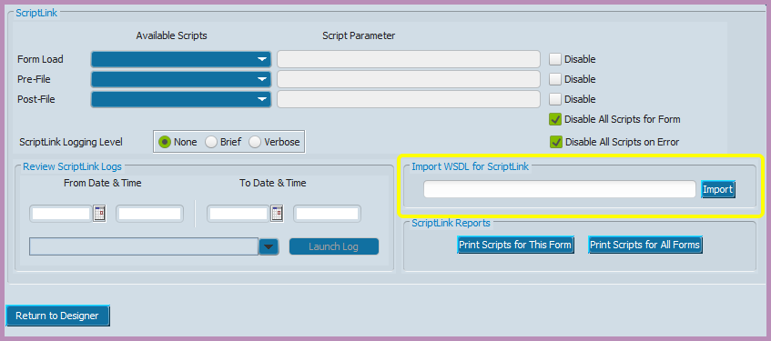

<!-- 220503.110300 -->

# Importing web services into myAvatar™

>Last updated: May 5, 2022 by [Chris Banwarth](https://github.com/APrettyCoolProgram)

***

### CONTENTS

[Introduction](#introduction) 
[Importing a web service into your environment](#importing-a-web-service-into-your-environment) 

***

# Introduction
In order for myAvatar™ to consume a web service - both Netsmart and custom - you'll need to import the web service into myAvatar™. These instructions will walk you through that process.

## Before you begin
To continue with this documentations, you will need to know the location of the web service you are going to import.

# Importing a web service into your environment
Importing a web service into your myAvatar™ environments is pretty simple. Here is how you do it.

## Confirming the web service WSDL
Before attempting to import a web service into myAvatar™, you should make sure that you have a valid **W**eb **S**ervice **D**escription **L**anguage (**WSDL**) URL. To do this

1. Paste the URL of the web service .asmx file in the address bar of a web browser, which should look like this:

`https://your-organization.com/MyAvatoolWebService.asmx`

2. Add `?WSDL` to the end of the URL, so it looks like this:

`https://your-organization.com/MyAvatoolWebService.asmx?WSDL`

3. Attempt to access that URL.

For example, pointing a browser to `https://your-organization.com/CustomAvatarWebService.asmx?WSDL` should display XML that looks something like this:

<h6 align="center">

  
   
  An example of a WSDL file
   

</h6>

If the XML above *is diplayed* in the browser, that URL is what you are going to need going forward.

If the XML above *is not displayed*, you'll need to get a valid WSDL location before continuing.

## Importing the web service WSDL
Any form can be used to import a web service, and once a web service has been imported it can be used by any form that allows ScriptLink events.

We will use the *Admissions* form to import the MAWS WSDL:
1. Open the **Form Designer** form
2. Choose the "Admissions" form from the **Forms** dropdown
3. Choose the XXX tab from the **Tabs** dropdown
4. Click the **Show Tab** button
5. You will now see the form tab in designer mode. In the upper left of myAvatar™ you will see a **Settings** button:

<h6 align="center">

  
   
  The "Settings" button.
   
</h6>

6. Clicking the **Settings** button will bring you to the ScriptLink options page. Right now we are interested in the **Import WSDL for ScriptLink** section:

<h6 align="center">

  
   
  The ScriptLink options page.
   
</h6>
 

7. Copy/paste the web service WSDL URL into the **Import WSDL for ScriptLink** field in myAvatar™
2. Click the **Import** button.

You should get a popup letting you know the WSDL was imported successfully.